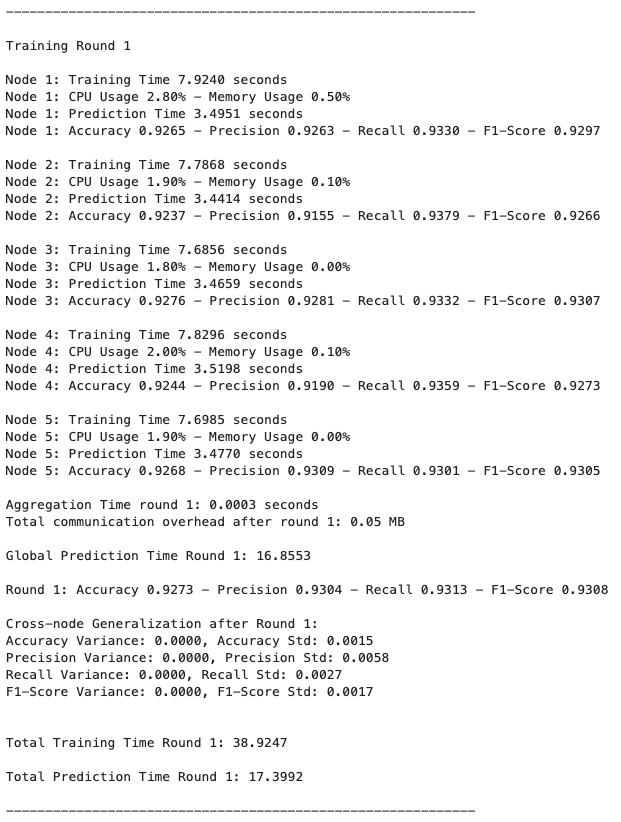
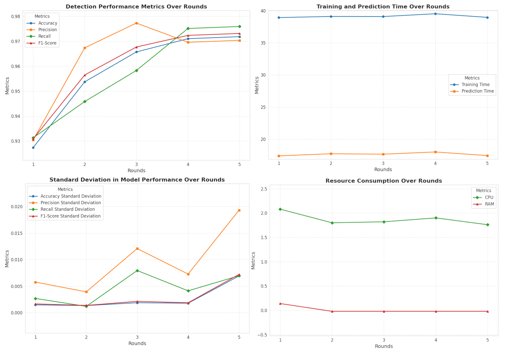
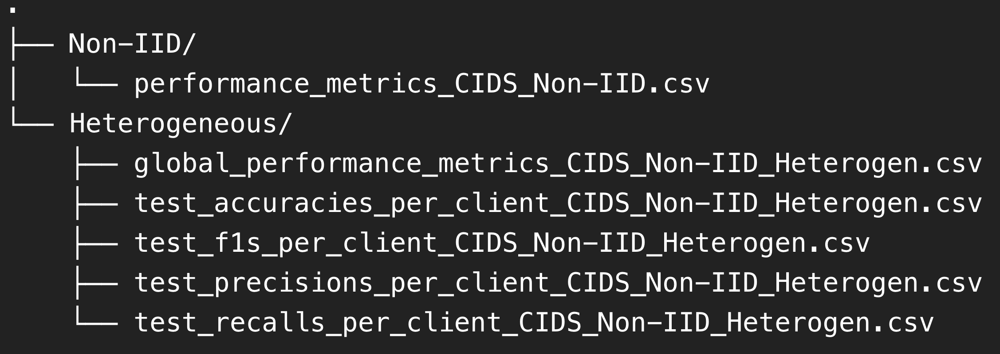

.. _output:

Simulator Output
===========

The simulator generates comprehensive outputs, including log data, graphical dashboards, and structured CSV files, to provide users with detailed insights into the evaluated metrics. As illustrated in Figure 1, CIDS simulator logs document critical performance indicators such as per-node training/prediction times, accuracy, precision, recall, F1-scores, and resource utilization (CPU/memory consumption), enabling a granular assessment of system efficiency. Interactive graphical visualizations (Figure 2}) enhance interpretability by plotting trends in detection performance—such as accuracy progression, precision-recall trade-offs, and F1-score stability—across federated training rounds, alongside auxiliary metrics like temporal resource usage patterns and model consistency (e.g., standard deviation in client performance). For archival and analysis, all results are systematically stored in CSV files (Figure 3), which organize data into categories such as Non-IID and Heterogeneous datasets, with columns specifying global model accuracy, client-specific F1-scores, and per-round computational overhead. These outputs collectively support comparative analysis, reproducibility validation, and optimization of federated CIDS configurations by revealing correlations between data heterogeneity, resource constraints, and threat detection efficacy.

**Figure 1**

**Figure 2**

**Figure 3**

