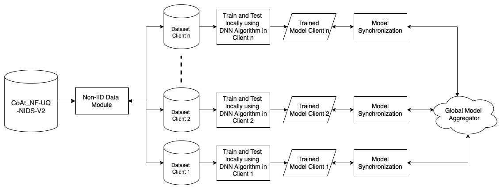
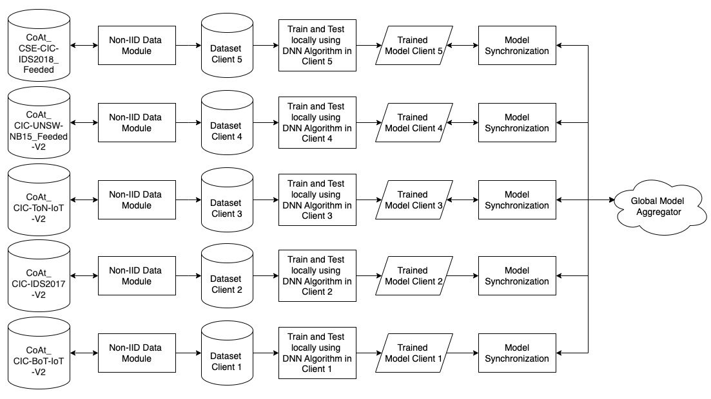

.. _overview:

Overview
===========

For cybersecurity researchers and developers, CIDS-Sim offers a versatile experimental framework to:

* Test and Compare Detection Algorithms: Evaluate novel intrusion detection mechanisms, anomaly detection models, or adversarial defense strategies in customizable scenarios.

* Assess System Efficiency: Measure communication overhead, computational resource utilization, and latency in federated environments, particularly under bandwidth constraints or intermittent connectivity.

* Analyze Model Robustness: Investigate how federated models perform across diverse network topologies, evolving threat landscapes, or skewed data distributions (e.g., rare attack types in specific nodes).

In educational contexts, CIDS-Sim functions as an immersive pedagogical tool for instructors and lecturers. It empowers students to interactively explore foundational and advanced topics in cybersecurity and machine learning, such as:

* Federated Learning Dynamics: Hands-on experimentation with model aggregation, client selection strategies, and differential privacy techniques.

* Data Privacy Principles: Visualizing how raw data remains decentralized while models achieve global convergence.

* Distributed System Challenges: Understanding trade-offs between accuracy, scalability, and resource allocation in federated setups.

By bridging theoretical concepts with practical experimentation, CIDS-Sim accelerates innovation in intrusion detection research while fostering a deeper understanding of privacy-aware, decentralized AI systems. Its adaptability makes it equally valuable for prototyping next-generation cybersecurity solutions, benchmarking federatedlearning frameworks, or designing engaging curricula for cybersecurity education.

In this research, the simulation of a **Collaborative Intrusion Detection System (CIDS)** leverages **CoAt-Set** (Coordinated Attack Dataset), a purpose-built dataset designed to address the unique challenges of intrusion detection in distributed and heterogeneous network environments. CoAt-Set incorporates **realistic coordinated attack scenarios**, such as multi-stage intrusions, lateral movement, and synchronized malicious activities across nodes, which are critical for evaluating the robustness of modern intrusion detection systems.  

The dataset integrates **heterogeneous network configurations** and employs widely adopted **IDS feature extraction tools**, including **NetFlow** and **CICFlowmeter**. These tools generate rich, multi-dimensional traffic profiles that capture both benign and malicious network behaviors, enabling the simulation of diverse and non-IID (non-independent and identically distributed) data distributions across participating clients—a key characteristic of real-world federated learning environments.  

This framework is specifically tailored to detect **coordinated attacks** that span multiple network segments, such as large-scale scanning, worm outbreaks, and Distributed Denial of Service (DDoS) attacks.

The use of CoAt-Set ensures reproducibility and benchmarking, as it provides standardized attack signatures, labeled traffic flows, and configurable network heterogeneity. This approach not only advances research in federated learning for cybersecurity but also offers practical insights into balancing **privacy-preserving collaboration** with **threat detection efficacy** in large-scale, decentralized networks.

.. note::

    Check out the :doc:`tutor/dataset` section for further information about dataset.

**Simulation with Scenario 1**

In the first scenario, illustrated in Figure above, the simulation uses the file ``CIDS-Sim_Non-IID.ipynb``. The diagram illustrates a **Federated Learning-based Collaborative Intrusion Detection System (CIDS)** under a **Non-IID (Non-Independent and Identically Distributed) data scenario**, utilizing the **CoAt_NF-UQ-NIDS-V2** dataset. The process begins with the dataset being processed through a **Non-IID Data Module**, which ensures that each client receives a unique subset of data. This reflects a realistic cybersecurity setting where different network nodes observe varying types of traffic and attack patterns. Unlike IID scenarios, where data is evenly distributed among clients, this approach results in heterogeneous datasets across different clients, making intrusion detection more challenging but also more representative of real-world network environments.

Each client (e.g., Client 1, Client 2, ..., Client n) receives its allocated dataset and trains a **Deep Neural Network (DNN)** model locally. The local training is performed independently on each client’s dataset, meaning no raw data is shared between nodes, thereby preserving data privacy and security. Once the training phase is completed, each client produces a **Trained Model**, which contains locally learned patterns from its dataset. These trained models are then passed through a **Model Synchronization** process, where they are prepared for aggregation.

After synchronization, the local models are sent to the **Global Model Aggregator**, where they are combined using a **Federated Averaging (FedAvg)**. This aggregation process helps create a more generalized global model that integrates knowledge from all client nodes, improving the system’s ability to detect diverse cyber threats. The updated global model can then be redistributed to clients for further training in subsequent rounds, ensuring continuous learning and adaptation to new threats.

**Simulation with Scenario 2**

In the second scenario, illustrated in Figure above, the simulation uses the file ``CIDS-Sim_Heterogeneous.ipynb``. This diagram represents a **Federated Learning-based Collaborative Intrusion Detection System (CIDS)** under a **completely heterogeneous Non-IID (Non-Independent and Identically Distributed) data scenario**. Unlike the previous setup where each client had different subsets of the same dataset, here, each client operates on a **completely different dataset**. The datasets used are **CoAt_CIC-BoT-IoT-V2.parquet, CoAt_CIC-IDS2017-V2.parquet, CoAt_CIC-ToN-IoT-V2.parquet, CoAt_CIC-UNSW-NB15_Feeded-V2.parquet, and CoAt_CSE-CIC-IDS2018_Feeded.parquet**, each representing different network environments and attack scenarios.

In this setup, each dataset is processed through a **Non-IID Data Module**, which distributes the data to different client nodes. Since the datasets are distinct, each client is exposed to a unique traffic pattern and attack distribution, making learning more complex but also more realistic. Each client then **trains a local Deep Neural Network (DNN) model** on its respective dataset, allowing it to specialize in detecting threats within its specific network environment.

After training, each client produces a **Trained Model**, which is then passed through a **Model Synchronization** step. This step ensures that the models are prepared for aggregation while preserving the privacy of the original datasets. The synchronized models are then sent to the **Global Model Aggregator**, which integrates the knowledge from all clients into a single, more robust global model. This federated learning approach allows the final model to generalize across multiple network environments, even though the local training data was highly heterogeneous.

The key difference in this scenario is that **each client is training on a completely different dataset**, which introduces significant challenges in terms of model convergence and generalization. The global model must learn from diverse network traffic and attack patterns without direct access to raw data, making this a highly realistic and privacy-preserving approach to intrusion detection. This setup is particularly useful for securing distributed systems where different organizations or network infrastructures may observe different types of cyber threats.

**Development Tool**

Software:
 * This simulator is develop using Python programming language
 * This simulator use Jupyter Notebook as code editor and to run the simulator

Hardware:
 * Processor (CPU): AMD EPYC 7713 64-Core
 * Memory (RAM): 64 GB